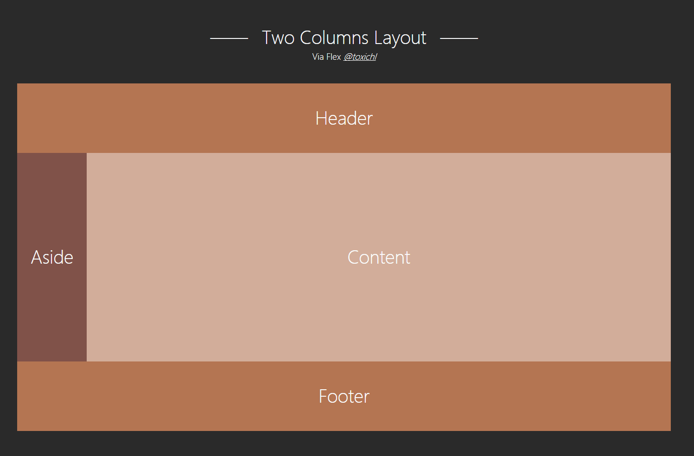
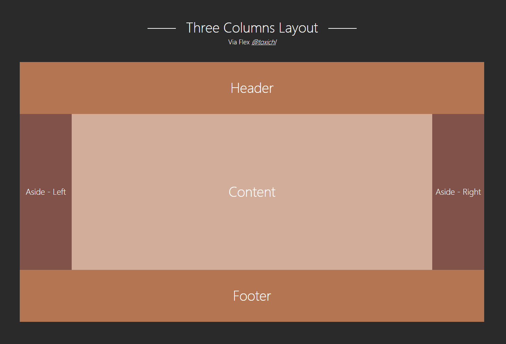
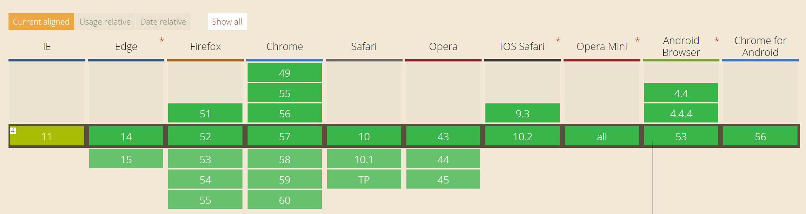

# CSS layout

Well-designed CSS layout samples

## Layout List

- Two Columns Layout
	- via `float`
	- via `negative margin`
	- via `flexbox`
	
- Three Columns Layout
	- via `negative margin`
	- via `flexbox`

## Demo

# Compatibility

- `float`： IE6+, Firefox 2+, Chrome 1+ etc
- `negative margin`: since IE6+, Firefox 2+, Chrome 1+ etc)
- `flex`： 

