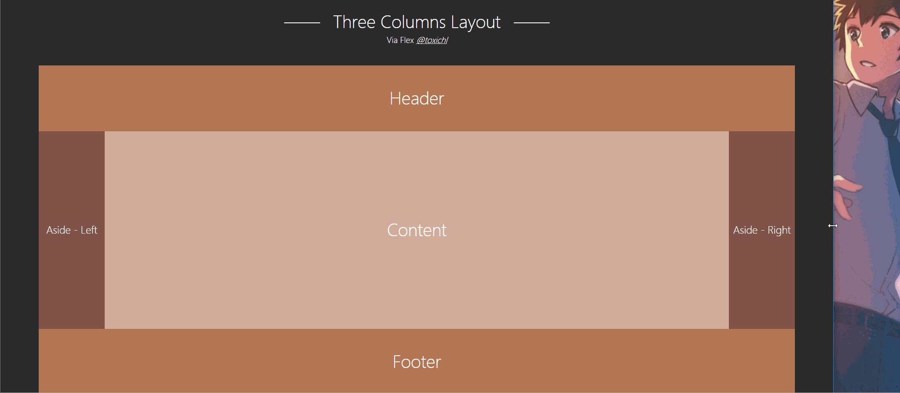

# CSS layout

CSS layout samples

## Layout List

- Two Columns Layout
	- via `float`
	- via `negative margin`
	- via `flexbox`
	
- Three Columns Layout
	- via `negative margin`
	- via `flexbox`

## Demo

### Two Columns Layout

### Three Columns Layout

### CSS Center - Text

## Compatibility

- `float`： IE6+, Firefox 2+, Chrome 1+ etc;
- `negative margin`: IE6+, Firefox 2+, Chrome 1+ etc;
- `flex`： Till 2017-3-28: 

## Suggestion

- Two columns in PC-side —— `float`;
- Three columns in PC-side —— `margin`;
- Mobile application —— `flex`。
